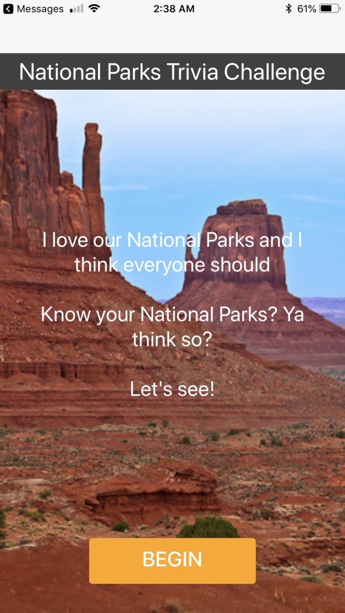
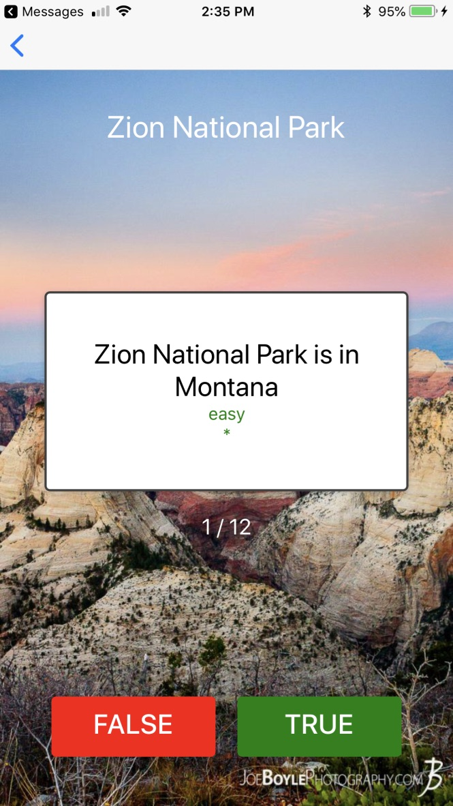
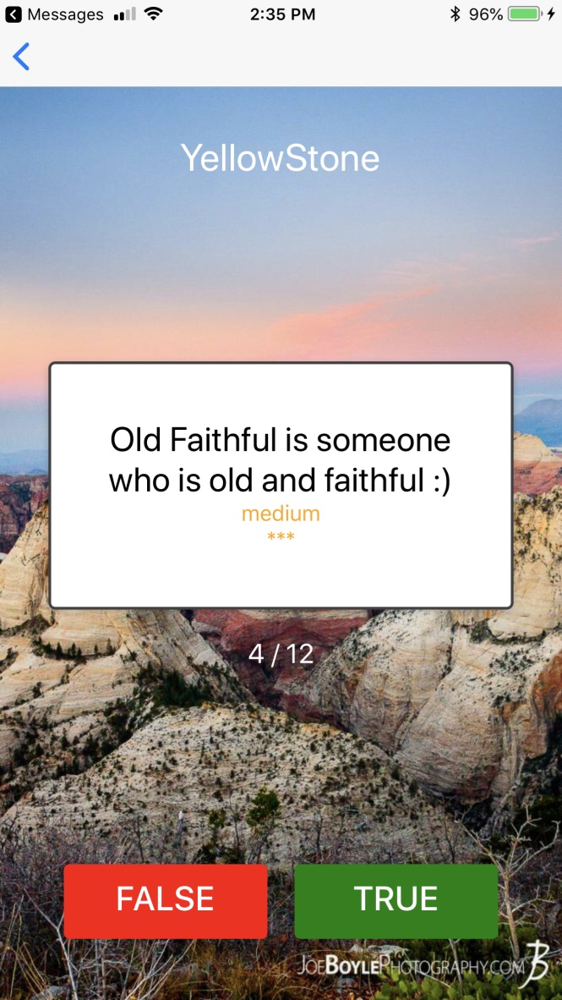
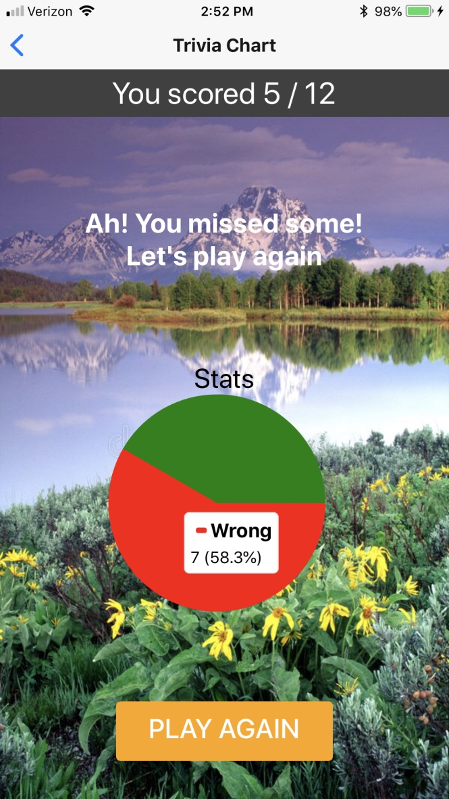

#### ParkTrivia - Know your parks, ya think so?

*Author: Ritesh Patel*

*Date: 06/24/2018*

---

**Description**

Ah, I absolutely love the immense beauty of our National Parks. Believe me if I had a choice I'd be totally into park hopping :) I know my parks, do you? Enjoy this fun trivia on National Parks :) 

**Stack**

ParkTrivia is a React Native app. Sure enough, api is on Express. Trivia questions live in a static json file. Api testcases are written with mocha / chai. App is tested via Expo on the iPhone.

**Run Trivia Run**

Start the express api. Yes, I have ```nodemon``` installed and running. Express is running on port 3008.

```
nodemon server
```

Start the react native app.

```
yarn start
```

Have expo send the URL to your preferred device. App will hot reload as you make changes to the code. 

**What does it look like?**

Well, here are some screenshots of the app...like I said, I love my parks. Ahhh...so soothing to see this beauty on my phone :)

*Landing Screen*



*Sample Questions*






*Trivia Results*



**Disclaimer**

In the past I have done Sencha Touch and built iOS app(s) with it. Having worked in React a bit, I thought to crack this nut by using React Native. Def. all ears on implementing more features and improvements :)

**Bugs / Questions**

Gimme a holler if you find one :)

Fork and enjoy!

Cheers!